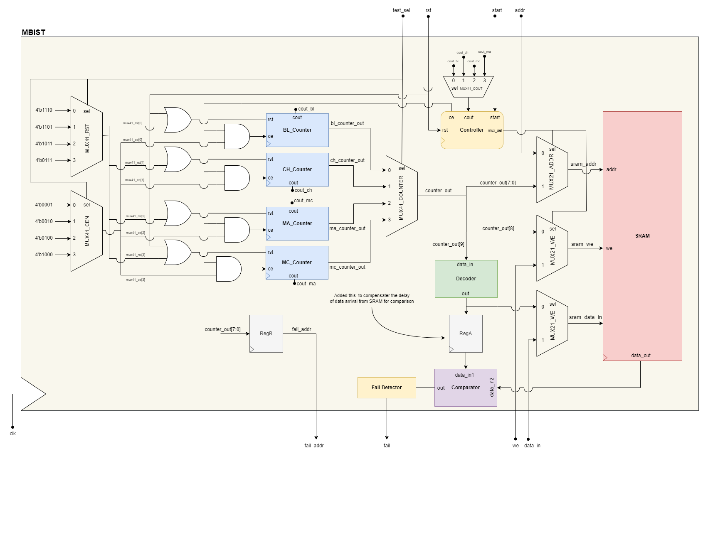

# BIST SRAM Design

## Introduction
Built-In Self Test (BIST) is a method used in digital circuit and system design and testing to guarantee proper operation and reliability. BIST allows self-testing and fault detection during operation without requiring external testing equipment, which can decrease testing costs and enhance product quality. BIST comprises embedded specialized hardware within the circuit to carry out self-tests. BIST circuits usually have a test pattern generator, signature analyzer, and fault detector. The test pattern generator creates test vectors that are used as inputs to the circuit, and the signature analyzer compares the circuit output to anticipated results to detect faults. The fault detector identifies the type and location of any faults detected by the BIST circuit. One of the main advantages of BIST is its ability to rapidly diagnose faults and identify their location, which can save time and effort in repairing the circuit. Moreover, BIST can be made to work during normal circuit operation, providing real-time monitoring and error detection that can enhance system reliability. BIST is widely used in a variety of digital systems, including processors, memory devices, and communication circuits. It is especially useful for complex systems that are challenging to test using external equipment due to their size or integration level. In summary, BIST is a valuable testing method for digital circuits and systems that offers an efficient and cost-effective approach to ensuring proper operation and reliability. Its use of specialized embedded hardware and fault detection capabilities can improve system quality, reduce testing costs, and save time in identifying and repairing faults.

## BIST Architecture
This section discusses the components of an MBIST (Memory Built-In Self-Test) system, which is used to test the functionality of memory cells. The four main components of an MBIST system are the decoder, comparator, controller, and counter. The detailed architecture diagram of the implemented design is as shown below.

### Decoder
A decoder is commonly used to decode binary information and activate specific devices or other blocks within the circuit. The decoder component is used to provide the test pattern(data) to the Single-port SRAM based on the specific bits from the output of the Counter register which acts as its select input line. Here the Decoder that we design is common for all the test algorithms (March C-, March A, Blanket 1 and 0, Checkerboard and Reverse Checkerboard). The decoder provides the test pattern data (test vectors) to the data multiplexer and to the Comparator. So the decoder is responsible for providing the correct test patterns based on the algorithm which we are running currently. Overall, the decoder is a critical component of an MBIST system, ensuring that all cells are tested thoroughly.

### Comparator
A Comparator is used to compare the expected data stored in a memory cell with the actual data which is read from that cell during the testing process. If the read data from the Single-port SRAM matches the expected data sent via the Decoder, the comparator outputs a ”pass” signal, otherwise it outputs a ”fail” signal at that cell address. So the comparator detects fault in the memory cells, ensuring that the device under test (single port SRAM) is functioning correctly.

### Controller
The Controller is responsible for managing the entire flow of the MBIST design. It consists of start signal which initialises the MBIST to start testing all the read-write operations (all stages) within each test algorithm. The cout is the key signal used in determining when to shift from on test algorithm to other. When the cout is high, we get to know that all the stages of read-write (into each cell) of that particular test algorithm has completed successfully. The cout is basically the carry bit of the Counter register. It also controls the address and data multiplexers which provide the address and data to be stored into the SRAM respectively. The controller plays a crucial role in an MBIST system as it coordinates the operation of the various components and ensures that the test process is carried out correctly. By generating the necessary control signals, the controller enables the MBIST system to test the memory cells thoroughly and detect any faults that may be present.

### Counter
In MBIST, a counter is used to generate a sequence of binary numbers that are primarily used to address the memory locations of SRAM during the testing process. The counter typically counts up from zero to a maximum value based on the number of memory locations in the memory being tested. We decide the width of the counter register based upon the test algorithm we are going to execute. Based on the test algorithm, we arrange the position of the counter register bits in such a way that it receives the dedicated bits which are to be sent to the other blocks like decoder (select input bits) and SRAM (address bits for each cell from 0 to 255). The counter register is designed differently for different testing algorithms. So the entire counter register width is split into parts dedicating bits to Decoder, write enable (which decides read and write operation), number of read-write stages (of a particular algorithm), address generation (0 to 255), and cout (which states the completion of each algorithm). For example, the part of least significant bits of the counter register provide addressing for all memory locations. For instance, in a memory with 256 locations, an 8-bit counter is used to address all locations, with the least significant 8 bits of the counter providing the memory address. The counter bit to the left of the address group of bits toggles between write and read operations (write enable). This bit controls whether data is written to the memory or read from the memory. The next most significant bits of the counter are decoded to generate the test vectors for testing memory. This allows the counter to be used to generate different test patterns for the memory, which can help detect faults such as stuck-at, transition, or coupling faults. The counter register carry-out (cout) becomes ”1” when the test pattern run completes, and the counter reaches its maximum value. This is used as an indicator that the test has completed, and the memory can be considered to be fully tested. By using a counter, memory testing can be automated and made more efficient, ensuring that the memory operates correctly and reliably in the final product.

### SRAM
In MBIST, a 256x4b single-port SRAM is a type of memory that has 256 memory locations, with each location capable of storing 4 bits of data. During the testing process, the memory can be divided into groups of memory locations called words. In the case of a 256x4b single-port SRAM, each word will consist of 4 memory locations, with each location storing 4 bits of data. The data (test vectors) are obtained through the decoder based on the currently running testing algorithm. The address is obtained from the Counter which decides which cell is to be read or write in SRAM out of 256 cells. During the testing process, the input data is written to the memory locations, and then read back to verify that the correct data has been written to the memory. This process is repeated for all memory locations and all words in the memory. The result of the test is then compared with the expected result to determine if the memory operates correctly. If the result matches the expected result in the Comparator, then the memory is considered to be functioning correctly. If the result does not match the expected result, then a fault has been detected, and further analysis is required to determine the cause of the fault. In conclusion, the 256x4b single-port SRAM in MBIST is used to store and retrieve data during the testing process, with each memory location being tested to ensure that the memory operates correctly and reliably in the final product.

### Multiplexers
The multiplexers also play an important role in the testing process by selecting the appropriate input (test vectors) data and memory addresses for the SRAM memory. Multiplexers are used to select the appropriate inputs for testing specific memory faults. By selecting the appropriate inputs, faults such as stuck-at, transition, or coupling faults can be detected. We also use a multiplexer to choose the particular counter for the required testing algorithm (March C-, March A, Blanket 1 and 0, Checkerboard and Reverse Checkerboard). By using multiplexers, memory testing can be automated and made more efficient, ensuring that the memory operates correctly and reliably in the final product.

## Results
### Behavioral Simulation
MBIST verification is carried out for each test using Vivado. The results indicate that for Blanket 0 and Blanket 1 tests, the muxSel signal transitions low after testing is completed. Throughout these tests, the fail pin consistently remains low, suggesting no detected faults in the SRAM. In Blanket 0 tests, the decoder output consistently registers as 4’b0000, while in Blanket 1 tests, it maintains a value of 4’b1111. However, when a fault is deliberately introduced within the SRAM, as confirmed during the verification process, the fail signal goes high at the specific fault address. This rise in the fail signal clearly points to the presence of a fault within the SRAM. This verification process encompasses all test cases, including test sel values of 0 (Blanket 0 and 1), 1 (Checker Board and Reverse Checker Board), 2 (March C-), and 3 (March A). For additional simulation results, please refer to the GitHub repository.

### Synthesis
Genus is used to convert a high-level hardware description into a gate-level netlist. This netlist can be used to create an integrated circuit. The tool optimizes the design for various parameters, such as performance, power consumption, and area, by using several optimization techniques, such as logic restructuring, clock gating, and technology mapping. The synthesis process also ensures that the design meets the specified timing requirements and constraints. The ultimate output of the synthesis process is a gate-level netlist that can be used for implementation and fabrication.

### Timing
Genus is also used to generate optimized gate-level netlists from the Behavioral RTL code. During the synthesis process, Genus provides various timing reports that provide detailed information about the timing characteristics of the synthesized design. These reports are critical for analyzing the design’s performance and for ensuring that the timing requirements of the design are met. This report indicates the amount of timing slack available in the design. Timing slack is the amount of time by which a path can be delayed without violating the design’s timing requirements. It also provides information about the timing characteristics of individual paths in the design. We provide various constraints to the RTL files to identify the violations and optimize the critical paths. From this timing report we see, the comparatively worst timing path seen is from test sel[1] to fail pin. In the given timing report, the slack value for Path 1 is 49528 ps. The slack value represents the amount of time by which the arrival time of the data can be delayed without violating the required time constraint. In this case, since the slack value is positive (49528 ps), it means that there is no setup or hold time violation for this path. The arrival time of the data is 50000 ps and the required time is 49840 ps, so the data has 49528 ps of slack available, which indicates that it is meeting the timing requirements with significant margin. Therefore, positive slack is a good indication that the design is meeting the timing requirements, and negative slack indicates that the design is violating the timing requirements.

## Conclusion
We developed a Verilog code for a 256x4b SRAM MBIST, integrated four test algorithms, and analyzed and optimized timing reports using the Genus synthesis tool. The timing reports provided critical information about the design, including critical paths, setup and hold times, and timing slack. By leveraging this information, we optimized the critical paths, resolved timing violations, and met the timing requirements. Our successful design implementation underscores the importance of using synthesis tools like Genus to ensure that digital designs meet their performance objectives. In conclusion, Built-In Self Test (BIST) is a highly effective technique for ensuring the proper operation and reliability of SRAM memory devices. By employing dedicated hardware embedded within the circuit to perform self-tests, BIST enables fault detection and self-testing during operation without the need for external testing equipment. This approach can reduce testing costs and improve product quality, while also providing real-time monitoring and error detection to enhance system reliability. BIST for SRAM can rapidly identify faults and determine their location, making it an essential testing method for digital circuits and systems, especially for large and complex systems that are challenging to test using external equipment. Overall, BIST for SRAM is a crucial tool in guaranteeing the high quality and reliability of memory devices in modern advanced technology applications.

